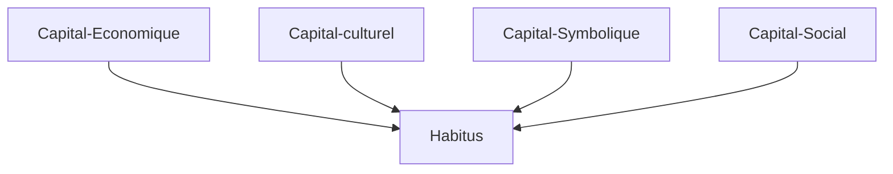

#conceptphilosophique propre à [[Pierre Bourdieu]]
Ensemble de facteurs socio-économiques qui déterminent l’individu

```mermaid 
graph TD 
Capital-Economique --> Habitus 
Capital-culturel --> Habitus 
Capital-Symbolique --> Habitus 
Capital-Social --> Habitus
```