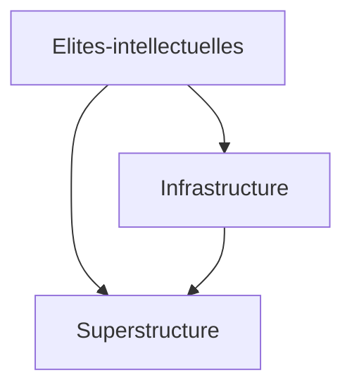

#conceptphilosophique 
Influence des structures sociales, economiques et politiques d’une societe sur le developpement de la conscience des individu de cette société

- Politique —> Obeissance [[Propagande]]
- Economique ([[Capitalisme]]) —> encourager consommation: pubs
- Religieuse —> Soumission

L’ideologie existe dans les regimes totalitaires ET dans les democratie (+fine, -visible) —> Influencer l’opinion publique

[[Autonomie]] = Illusoire
[[Hétéronomie]]

